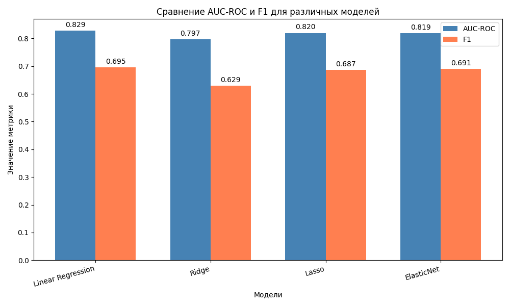

# Сравнение линейных алгоритмов классификации Scikit-learn
___
## Задача: 
### Предсказание вероятностей ухода клиентов

## Модели:
1. LogisticRegression
2. Perceptron
3. RidgeClassifier
4. LinearDiscriminantAnalysis
#
### Сравнение происходит по двум метрикам: ***F1 score*** и ***AUC-ROC***

*Визуализация метрик в MatPlotLib*
